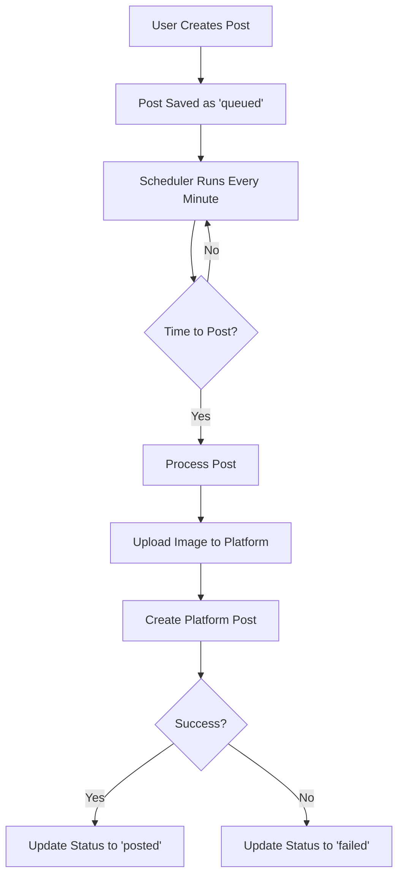

# KocialPilot - Social Media Scheduler

A powerful, modern social media scheduling platform built with Next.js 15, TypeScript, and MongoDB. Schedule posts across multiple platforms with AI-generated captions and automated posting.

## Features

- 🤖 **AI Caption Generation** - Automatic captions using Hugging Face or smart fallback
- 📅 **Visual Calendar** - Interactive calendar view for managing scheduled posts
- 🎨 **Image Management** - Drag & drop image uploads with preview
- 🌙 **Dark Mode** - Modern OKLCH color system with theme switching
- 📱 **Responsive Design** - Mobile-first design that works on all devices
- ⏰ **Smart Scheduling** - Node-cron based automatic posting
- 🔗 **Multi-Platform** - Facebook (Instagram, Twitter, LinkedIn ready)
- 🎯 **Post Queue** - Manage and edit scheduled posts
- ✨ **Modern UI** - Built with shadcn/ui and Tailwind CSS

## Tech Stack

- **Framework:** Next.js 15 (App Router)
- **Language:** TypeScript
- **Database:** MongoDB with Mongoose
- **UI:** Tailwind CSS + shadcn/ui
- **Animations:** Framer Motion
- **Scheduling:** Node-cron
- **Theme:** next-themes
- **File Upload:** Multer
- **Icons:** Lucide React

## Project Structure

```
kocialpilot/
├── src/
│   ├── app/
│   │   ├── api/
│   │   │   ├── ai/
│   │   │   │   └── caption/
│   │   │   │       └── route.ts          # AI caption generation
│   │   │   ├── facebook/
│   │   │   │   └── post/
│   │   │   │       └── route.ts          # Facebook posting API
│   │   │   ├── posts/
│   │   │   │   └── route.ts              # Posts CRUD API
│   │   │   ├── scheduler/
│   │   │   │   └── route.ts              # Scheduler control API
│   │   │   └── upload/
│   │   │       └── images/
│   │   │           └── route.ts          # Image upload API
│   │   ├── globals.css                   # OKLCH theme + styles
│   │   ├── layout.tsx                    # Root layout with providers
│   │   └── page.tsx                      # Main dashboard page
│   ├── components/
│   │   ├── features/
│   │   │   ├── image-upload/
│   │   │   │   └── ImageUploader.tsx     # Image upload component
│   │   │   ├── posting/
│   │   │   │   └── CreatePostDialog.tsx  # Post creation dialog
│   │   │   └── scheduling/
│   │   │       ├── CalendarView.tsx      # Interactive calendar
│   │   │       ├── PostQueue.tsx         # Post management
│   │   │       └── SchedulePreferences.tsx # Schedule settings
│   │   ├── layout/
│   │   │   ├── Header.tsx                # Responsive header
│   │   │   └── Sidebar.tsx               # Desktop sidebar
│   │   ├── providers/
│   │   │   └── ThemeProvider.tsx         # Theme context
│   │   └── ui/                           # shadcn/ui components
│   ├── lib/
│   │   ├── db.ts                         # MongoDB connection
│   │   └── utils.ts                      # Utility functions
│   └── models/
│       ├── Image.ts                      # Image model
│       └── Post.ts                       # Post model
├── public/
│   └── uploads/                          # Uploaded images storage
├── .env.local                            # Environment variables
├── package.json                          # Dependencies
├── tailwind.config.ts                    # Tailwind configuration
└── README.md                             # This file
```

## Quick Start

### Prerequisites

- Node.js 18+ 
- MongoDB (local or cloud)
- Facebook Developer Account (for posting)

### Installation

1. **Clone the repository**
```bash
git clone https://github.com/abdur-rakib-rony/KocialPilot---Social-Media-Scheduler.git
cd kocialpilot
```

2. **Install dependencies**
```bash
npm install
```

4. **Start development server**
```bash
npm run dev
```

5. **Open your browser**
Navigate to [http://localhost:3000](http://localhost:3000)

## API Documentation

### Image Upload API
```http
POST /api/upload/images
GET  /api/upload/images
```

### Posts API  
```http
GET    /api/posts              # Get all posts
POST   /api/posts              # Create new post
PUT    /api/posts              # Update post
DELETE /api/posts?id=123       # Delete post
```

### AI Caption API
```http
POST /api/ai/caption
{
  "imagePath": "/uploads/image.jpg",
  "customPrompt": "Beautiful scene:"
}
```

```

### Facebook Posting API
```http
POST /api/facebook/post
GET  /api/facebook/post        # Check connection
{
  "postId": "post_id_here"
}
```

## Configuration

### Facebook Setup

1. **Create Facebook App**
   - Go to [Facebook Developers](https://developers.facebook.com/)
   - Create new app → Business → Next

2. **Get Page Access Token**
   - Add Facebook Login product
   - Generate User Access Token
   - Exchange for Page Access Token

3. **Add to Environment**
```env
FACEBOOK_ACCESS_TOKEN=your_long_lived_page_token
FACEBOOK_PAGE_ID=your_facebook_page_id
```

### 1. Upload Images
- Drag & drop images or click to browse
- Supports JPEG, PNG, GIF, WebP (max 10MB)
- Images stored in `public/uploads/`

### 2. Create Posts
- Click "Create New Post" 
- Choose Manual or Automatic mode
- Generates captions automatically
- Set schedule time and platform

### 3. Manage Schedule
- View posts in calendar or queue
- Edit, delete, or reschedule posts
- Start/stop the automatic scheduler

### 4. Monitor Status
- Check scheduler status in preferences
- View upcoming posts
- Monitor posting success/failures

## Scheduler Workflow



## License
N/A


## Acknowledgments

- [shadcn/ui](https://ui.shadcn.com/) for beautiful components
- [Framer Motion](https://www.framer.com/motion/) for smooth animations  
- [Lucide](https://lucide.dev/) for amazing icons
---